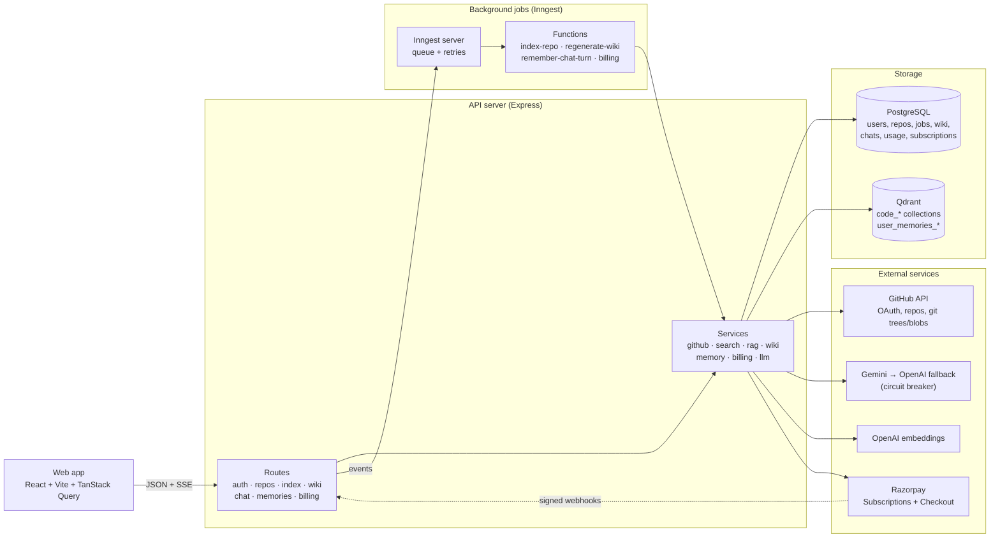

# AutoWiki (Auto-Git-Wikki)

Sign in with GitHub, pick a repository, index it, and get:

- an **AI-generated wiki** (overview, architecture, modules, setup) with source links, and
- a **chat** that answers questions about the code with file + line citations, personalised
  with what it remembers about you.

[CLAUDE.md](CLAUDE.md) is the source of truth for stack, schema, conventions and design system;
[docs/phase-reports](docs/phase-reports) records how each part was built and verified.

## Run it from scratch

### 1. Requirements

- **Node.js 20.12+** (the server uses `process.loadEnvFile`) and npm 10+
- **Docker** (PostgreSQL 16 and Qdrant run in containers)
- A **GitHub OAuth App** — GitHub → Settings → Developer settings → OAuth Apps → New:
  - Homepage URL: `http://localhost:5173`
  - Authorization callback URL: `http://localhost:4000/api/auth/github/callback`
- API keys: **OpenAI** (embeddings + fallback generation) and, optionally, **Gemini**
  (primary generation; when it is missing or over quota, OpenAI answers instead)

### 2. Install and configure

```bash
npm install
cp .env.example .env
```

Fill in `.env` (see [Environment variables](#environment-variables)): at least
`GITHUB_CLIENT_ID`, `GITHUB_CLIENT_SECRET`, `SESSION_JWT_SECRET`, `TOKEN_ENCRYPTION_KEY` and
`OPENAI_API_KEY`. Generate the two secrets with:

```bash
node -e "console.log(require('crypto').randomBytes(48).toString('base64url'))"
node -e "console.log(require('crypto').randomBytes(32).toString('base64'))"
```

### 3. Start infrastructure and the database schema

```bash
npm run infra:up
npm run db:migrate
```

If port 5432 or 6333 is taken, change `POSTGRES_HOST_PORT` / `QDRANT_HOST_PORT` in `.env`
and update `DATABASE_URL` / `QDRANT_URL` to match.

### 4. Run — **both** processes, in two terminals

```bash
npm run dev
```

```bash
npm run inngest:dev
```

`npm run dev` serves the web app (http://localhost:5173) and the API (http://localhost:4000).
`npm run inngest:dev` runs the background-job worker (dashboard at http://localhost:8288).
**Indexing, wiki generation and memory learning need both.** Without Inngest, an index job
stays queued and expires after 10 minutes with a hint.

Open http://localhost:5173 and sign in with GitHub. Indexing and chat need a plan: add your
GitHub login to `COMP_GITHUB_LOGINS` in `.env` for a free (complimentary) Max plan, or set up
Razorpay test mode as described in [docs/BILLING.md](docs/BILLING.md) and subscribe on
`/pricing`. Then press **Index repository** on any repo and open its **Wiki** tab or
**Chat with repo**.

## Architecture



- **Indexing** (`index-repo`): resolve commit → list + filter files → fetch and chunk with
  tree-sitter → embed and upsert to Qdrant (unchanged chunks reuse vectors) → clean up old
  points → generate the wiki → finalize. Progress steps come from the server.
- **Chat** (`POST /api/threads/:id/ask`, SSE): rewrite follow-ups → `searchRepo` (the repo's
  own embedding model) → keyword re-scoring → context → stream with model fallback. User
  memories are looked up in parallel and only tailor tone and depth.
- **Wiki**: outline (strict JSON, validated) → one page per entry from the same retrieval
  path → file-path hallucination check → saved per run; regenerate without re-embedding.
- **Memory**: [Custom-Memory-Engine](https://github.com/Rajaryan1726/Custom-Memory-Engine)
  (pinned dependency) learns facts about the _user_ from their own redacted messages only.
- **Limits**: per-user limits and a daily AI token budget (`llm_usage`), rate limits per
  route, structured logs (pino) with request ids.

```
apps/web         React app: pages, features (repos, index-jobs, wiki, chat, memory, account)
apps/server      Express API: routes, services, db (Drizzle), inngest, scripts, eval
packages/shared  Types and zod schemas used by both
docs/            Phase reports; injection-test-repo (prompt-injection test fixtures)
```

## Scripts

| Script                                      | What it does                                                                                                           |
| ------------------------------------------- | ---------------------------------------------------------------------------------------------------------------------- |
| `npm run dev`                               | Shared types (watch) + API server + web app                                                                            |
| `npm run inngest:dev`                       | Inngest dev server (background jobs); **run alongside `npm run dev`**                                                  |
| `npm run infra:up` / `infra:down`           | Start (and wait for) / stop Postgres + Qdrant; data volumes are kept                                                   |
| `npm run db:migrate`                        | Apply pending migrations                                                                                               |
| `npm run db:generate`                       | Generate a Drizzle migration from the schema                                                                           |
| `npm run build`                             | Build shared, server and web                                                                                           |
| `npm run typecheck`                         | Type-check every workspace                                                                                             |
| `npm run lint` / `format` / `format:check`  | ESLint / Prettier write / Prettier check                                                                               |
| `npm test`                                  | Server unit + integration tests (integration tests need `infra:up`)                                                    |
| `npm run eval:retrieval`                    | Retrieval eval on the tuned set: hit@3 and MRR@10, dense vs re-scored (`--verbose`)                                    |
| `npm run eval:retrieval:heldout`            | The same on the held-out set (never used for tuning)                                                                   |
| `npm run eval:memory`                       | User-memory eval: scripted conversations + latency / memory-down checks                                                |
| `npm run eval:injection -- <owner/repo>`    | Prompt-injection check on the test repo from `docs/injection-test-repo` (chat, wiki, memory)                           |
| `npm run check:contrast`                    | WCAG contrast of the design tokens in both themes                                                                      |
| `npm run dev:chunks -- <repo> <path>`       | Print the chunks of one file (`local <path>` for a file on disk; `--text`)                                             |
| `npm run dev:search -- <repo> "<question>"` | Semantic search over a repo's last index (`--k 5`, `--text`)                                                           |
| `npm run dev:ask -- <repo> "<question>"`    | One question through the chat pipeline (`--follow-up "<earlier>"`)                                                     |
| `npm run dev:wiki -- <repo>`                | Wiki outline and per-page stats (`--regenerate`, `--page <slug>`)                                                      |
| `npm run dev:session -- <github-username>`  | **Local development only**: a session cookie without OAuth (`--out <file>`); refuses to run with `NODE_ENV=production` |
| `npm run billing:sync-plans`                | Create the Starter / Pro / Max plans in Razorpay (mode of the key) if missing; idempotent                              |
| `npm run billing:cost-report`               | Average / max actual cost per user per billing period, by plan, vs price and Razorpay fee                              |
| `npm run billing:simulate -- <sub> <event>` | **Local development only**: send a signed Razorpay webhook to the local API (pending, halted, charged…)                |

`<repo>` accepts a repo id, `owner/name` or the name.

## Environment variables

All configuration comes from the root `.env` ([.env.example](.env.example) lists every
variable with comments). Required ones are marked **R**.

| Variable                                                                                                                   | Default                             | Purpose                                                            |
| -------------------------------------------------------------------------------------------------------------------------- | ----------------------------------- | ------------------------------------------------------------------ |
| `NODE_ENV`                                                                                                                 | `development`                       | `production` enables secure cookies, trusted proxy, JSON logs      |
| `PORT`                                                                                                                     | `4000`                              | API port                                                           |
| `WEB_ORIGIN` **R**                                                                                                         |                                     | Web app origin (CORS with credentials)                             |
| `SERVER_URL` **R**                                                                                                         |                                     | Public API URL (OAuth callback)                                    |
| `VITE_API_URL`                                                                                                             | `http://localhost:4000`             | API URL used by the browser                                        |
| `POSTGRES_HOST_PORT`, `QDRANT_HOST_PORT`                                                                                   | `5432`, `6333`                      | Host ports for docker-compose                                      |
| `DATABASE_URL` **R**                                                                                                       |                                     | Postgres connection string                                         |
| `QDRANT_URL` **R**, `QDRANT_API_KEY`                                                                                       |                                     | Qdrant (key only for secured instances)                            |
| `INNGEST_EVENT_KEY`, `INNGEST_SIGNING_KEY`                                                                                 | empty                               | Only for Inngest Cloud (empty = local dev server)                  |
| `GITHUB_CLIENT_ID` **R**, `GITHUB_CLIENT_SECRET` **R**                                                                     |                                     | GitHub OAuth App                                                   |
| `SESSION_JWT_SECRET` **R**                                                                                                 |                                     | ≥ 32 characters; signs the session cookie                          |
| `TOKEN_ENCRYPTION_KEY` **R**                                                                                               |                                     | 32 bytes base64; AES-256-GCM for GitHub tokens                     |
| `GEMINI_API_KEY`, `OPENAI_API_KEY`                                                                                         |                                     | Model providers (OpenAI needed for the default embeddings)         |
| `GEN_MODEL_PRIMARY` **R**, `GEN_MODEL_FALLBACK` **R**                                                                      |                                     | Generation models (Gemini, then OpenAI)                            |
| `EMBEDDING_MODEL` **R**, `EMBEDDING_DIMS` **R**                                                                            |                                     | Embedding model; provider follows the id                           |
| `EMBED_CONCURRENCY`                                                                                                        | `2`                                 | Parallel embedding calls per process                               |
| `GEMINI_EMBED_MAX_RPM` / `_BATCH_SIZE` / `_MAX_TPM`                                                                        | `90` / `100` / `0`                  | Gemini embedding throttle                                          |
| `OPENAI_EMBED_MAX_RPM` / `_MAX_TPM` / `_BATCH_SIZE`                                                                        | `500` / `900000` / `128`            | OpenAI embedding throttle                                          |
| `MEMORY_RECALL_TIMEOUT_MS`                                                                                                 | `800`                               | Max time memory may add to an answer (after retrieval)             |
| `MEMORY_RECALL_LIMIT`                                                                                                      | `5`                                 | Question-relevant memories per answer (plus preferences)           |
| `LIMIT_MAX_INDEXED_REPOS`                                                                                                  | `10`                                | Repos a user can have indexed at once                              |
| `LIMIT_INDEX_JOBS_PER_DAY`                                                                                                 | `20`                                | Index jobs per user per UTC day                                    |
| `LIMIT_WIKI_REGENERATIONS_PER_DAY`                                                                                         | `10`                                | Wiki regenerations per user per UTC day                            |
| `LIMIT_CHAT_MESSAGES_PER_HOUR`                                                                                             | `60`                                | Chat questions per user in a rolling hour                          |
| `LIMIT_MAX_REPO_FILES`                                                                                                     | `2000`                              | Indexable files per repository                                     |
| `LLM_DAILY_TOKEN_BUDGET`                                                                                                   | `1000000`                           | Input + output tokens per user per UTC day                         |
| `RATE_LIMIT_AUTH_PER_MIN` / `_INDEX_` / `_WIKI_` / `_ASK_`                                                                 | `20` / `10` / `5` / `20`            | Requests per minute (auth per IP, others per user)                 |
| `LOG_LEVEL`                                                                                                                | `info`                              | pino log level                                                     |
| `RAZORPAY_KEY_ID`, `RAZORPAY_KEY_SECRET`                                                                                   |                                     | Razorpay API keys (`rzp_test_…` in test mode); see docs/BILLING.md |
| `RAZORPAY_WEBHOOK_SECRET`                                                                                                  |                                     | Secret of the Razorpay webhook (`/api/billing/webhook`)            |
| `COMP_GITHUB_LOGINS`                                                                                                       | empty                               | GitHub logins with a free Max plan ("Complimentary")               |
| `BILLING_TOTAL_COUNT`                                                                                                      | `60`                                | Monthly cycles of a new Razorpay subscription                      |
| `BILLING_USD_INR`, `LLM_PRICES_USD_PER_MTOK`, `EMBED_PRICE_USD_PER_MTOK`, `EMBED_TOKENS_PER_CHUNK`, `RAZORPAY_FEE_PERCENT` | `88`, `{"*":…}`, `0.02`, `350`, `2` | Only for `billing:cost-report`                                     |

## Troubleshooting

- **"The indexing job never started"** — `npm run inngest:dev` is not running.
- **Answers say "Answered by gpt-…" although Gemini is primary** — Gemini failed or is over
  quota; the circuit breaker routes to OpenAI for up to an hour (logged).
- **Signed out with "GitHub access was revoked"** — the app's access was removed on GitHub
  (or the token expired); sign in again.
- **"You have used today's AI budget"** — the daily token budget is used up; it resets at
  00:00 UTC. Indexed code, wikis and chats stay available.
